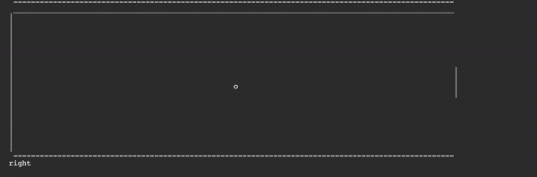

# Pong
Replicating the video game pong in Python, except with a one-control interface, like flappy bird. the user's paddle will automatically move down, and the user can press control+c to move it up. Works very well, inculding automated computer paddle moving.
# Pong demo

# What works so far
- ball bouncing off sides of arena
- Algorithms that move the ball in one of the following directions
  - right
  - left
  - rightup
  - leftup
  - rightdown
  - leftdown
- printing arena with ball
- paddle controls
- paddles + paddle moving
- ball bouncing off of wall on other side
- make computer play against you with a moving paddle
- scoring
- Computer automated paddle moving works super well, and it never misses. I should make it so that it sometimes misses.
# What is to be done
- scoreboard text file storage
- make ball movements a little more randomized
- make it so that computer sometimes misses the ball
